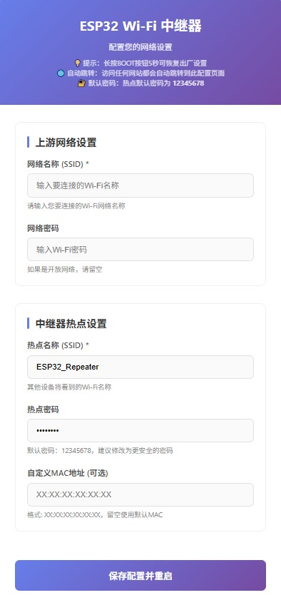

# ESP32 wifi 中继器

## 项目简介

ESP32 NAT路由器是一个基于ESP32芯片的WiFi中继/NAT路由器实现。该项目允许您将ESP32设备作为无线路由器使用，可以连接到现有的WiFi网络并创建自己的无线接入点，实现网络共享和扩展。

### Web配置界面




## 功能特点

- **双WiFi接口**：同时作为客户端(STA)和接入点(AP)
- **NAT路由**：内置NAT功能，实现网络数据包转发
- **强制门户**：自动跳转到配置界面，方便初始设置
- **Web配置界面**：直观的网页界面进行设置
- **持久化配置**：所有配置保存在NVS闪存中，重启后依然有效
- **企业级WiFi支持**：支持WPA2企业认证
- **静态IP设置**：可配置静态IP地址

## 硬件要求

- ESP32开发板
- USB数据线
- 5V电源

## 软件依赖

- ESP-IDF (推荐v5.4或更高版本)
- CMake构建系统

## 编译与烧录

1. 安装ESP-IDF开发环境
2. 克隆此项目到本地
3. 导航到项目目录
4. 编译项目：
   ```
   idf.py build
   ```
5. 烧录到ESP32：
   ```
   idf.py -p [串口] flash
   ```

## 使用方法

1. 烧录固件后，ESP32将启动一个名为"ESP32_Repeater"的WiFi热点(默认密码为12345678)
2. 使用设备连接到此WiFi热点
3. 系统将自动弹出配置页面(强制门户)，若未自动弹出，请访问 http://192.168.4.1
4. 在Web界面中配置：
   - 上游WiFi网络(SSID和密码)
   - 热点设置(名称和密码)
   - 其他高级选项
5. 保存设置后，设备将自动重启并连接到配置的上游WiFi
6. 长按 5s GPIO0 的按键，可以清除flash保存的wifi配置信息

## 配置选项

### AP设置(热点)
- **SSID**：热点名称
- **密码**：热点密码(少于8个字符则为开放网络)
- **MAC地址**：可选，自定义热点MAC地址

### STA设置(上游WiFi)
- **SSID**：要连接的WiFi名称
- **密码**：WiFi密码

## 故障排除

- **无法连接到上游WiFi**：检查SSID和密码是否正确
- **无法访问互联网**：确认上游WiFi网络是否具有互联网连接
- **设备不断重启**：通过串口监视器检查错误日志
- **Web界面无法访问**：尝试重启设备

## 许可证

本项目代码遵循开源协议发布，详见项目文件。
